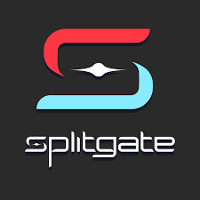

<!DOCTYPE html>
<html>
<body>
<h1 style="font-family:Lucida Handwriting;font-size:50px;" align="center">A Deep Dive into Splitgate</h1>

<h2 style="font-family:Arial;font-size:20px;">Beginnings and Progress</h2>

Ian Proulx and his crew formed 1047 Games, an obscure studio that started as Splitgate. The main objective of the game, which was first developed as a side project in 2016, was to blend the action-packed, typical first-person shooter gameplay with a novel twist—portal mechanics. Inspired by the portal technology used in games such as Portal and Portal 2, the concept aims to provide players with an exciting new strategic experience.

  In 2019, the game entered early access so that users could test it out and give feedback on how its features were evolving. Splitgate became the sophisticated game it is today thanks in large part to this continuous development process. After numerous changes and improvements, Splitgate was formally launched in 2021, representing a major turning point for 1047 Games.

<h3 style="font-family:Arial;font-size:20px;">Creativity and Gameplay Mechanics</h3>

Splitgate is primarily a fast-paced first-person shooter game with strong ties to classic games like Halo. The use of portal mechanics, a unique characteristic of the game that sets it aside from it's competitors, serves as what makes it unique. By placing portals on particular surfaces, players can add a strategic and dynamic element to the gameplay. Players can move around battlefields with never-before-seen freedom and outmanoeuvre opponents in creative ways thanks to these portals, which provide instantaneous travel between two spots.
Players must consider strategies beyond standard first-person shooter tactics because of the intriguing layer of complexity added by the portal mechanic.

Splitgate offers a range of classic first-person shooter components in addition to its portal-based action, such as an extensive arsenal of weapons, customisable loadouts, and several game modes. Together, these elements provide a compelling and well-rounded game that appeals to both casual and competitive players.

<h4 style="font-family:Arial;font-size:20px;">Effects and Reception</h4>

When Splitgate was officially released, it received a lot of praise for taking an original approach to the first-person shooter genre. Both gamers and critics commended the game for its sophisticated gameplay and fresh ideas. Audiences responded favourably to the fusion of traditional themes and modern twists, creating a vibrant and encouraging community.

The way multiplayer shooters have continued to evolve has been one of Splitgate's major contributions. The game has successfully shown the potential for creativity and experimentation within the genre by fusing classic first-person shooter components with interesting dynamics. Since the early access period allows the developers to improve and adjust the game in response to user comments, it has also brought attention to how important community feedback is in guiding a game's development.

<h5>Conclusion</h5>

Splitgate is a noteworthy development in the online gaming space that shows how innovative features may bring new life to established genres. The game's unique blend of portal-based action and classic first-person shooter aspects has raised the bar for innovation and elegance in the genre. Splitgate is proof of the potential for creativity and the ongoing attraction of well-done gameplay mechanics as it keeps growing and inspiring new improvements. Splitgate's success is a reflection of the times as well as a signpost for further multiplayer gaming research.

To play, download by clicking <a href="https://store.steampowered.com/app/677620/Splitgate/">here</a>

